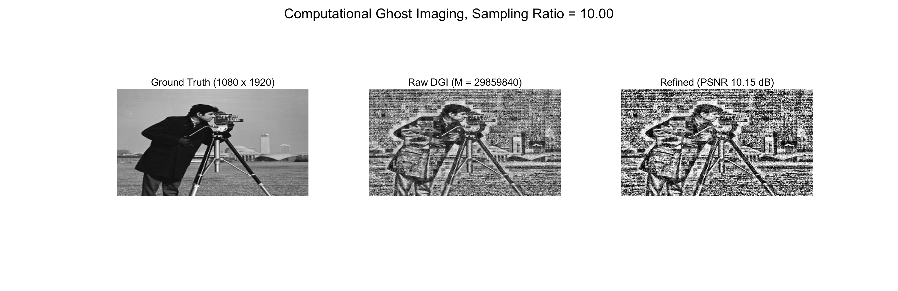

# Computational Ghost Imaging (CGI) Simulation

MATLAB implementation of **Computational Ghost Imaging (CGI)** using a **single self-contained script**. The goal is to keep the physical process and reconstruction logic easy to read from top to bottom in one file.

## Mathematical Principle

The object transmission is denoted as $T(x,y)$ and the $i$-th random illumination pattern is $P_i(x,y)$.

The bucket detector signal is:

$$
B_i = \iint P_i(x,y)\,T(x,y)\,dx\,dy
$$

For normalized DGI reconstruction:

$$
G(x,y)=\left\langle\left(B_i-\alpha R_i\right)\left(P_i(x,y)-\left\langle P(x,y)\right\rangle\right)\right\rangle,\quad
\alpha=\frac{\langle B\rangle}{\langle R\rangle},\quad
R_i=\sum_{x,y} P_i(x,y)
$$


## Simulation Result


*Left: Ground Truth, Middle: Raw DGI, Right: Refined Reconstruction*

## Script Logic

Everything is written in [src/main_cgi.m](src/main_cgi.m), in this order:

1. Set imaging parameters.
2. Load and normalize the object.
3. Simulate random-pattern illumination and bucket detection.
4. Reconstruct the image using Differential Ghost Imaging.
5. Apply mild display enhancement.
6. Save the figure, reconstructed image, and `.mat` data.

## Project Structure

```text
src/
  main_cgi.m                    % Single-file CGI simulation and reconstruction

results/
  cgi_result.png
  cgi_reconstruction.png
  cgi_result.mat
```

## Usage

1. Open MATLAB in this repository root.
2. Run:
   ```matlab
   run('src/main_cgi.m')
   ```
3. Edit the parameters at the top of `src/main_cgi.m` if needed.

## Recommended Parameter Presets

- Fast preview:
  - `N = 128;`
  - `M_ratio = 6;`
  - `batch_size = 64;`

- Better quality:
  - `N = 256;`
  - `M_ratio = 8;`
  - `batch_size = 64;`

- Slower but finer:
  - `N = 384;`
  - `M_ratio = 10;`
  - `batch_size = 32;`

## Notes

- In standard CGI with random pixel-wise patterns, runtime grows very quickly with `N` and `M_ratio`.
- For most machines, `N = 256` is a practical starting point.
- If you directly push to very large resolutions, the simulation can become extremely slow.

---
Keywords: Single-Pixel Imaging, Ghost Imaging, Differential GI, Inverse Problems, MATLAB
